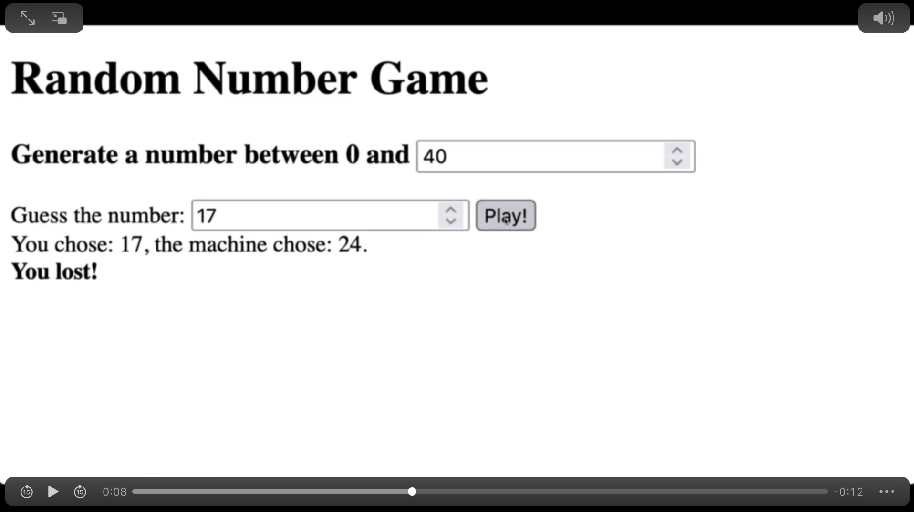

# Assignment7

## TA's hint
- <form>: 사용자로부터 입력받을 수 있는 입력 form을 정의할 때 사용하는 태그. 입력한 정보를 제출할 수 있음. 
- querySelector 
: CSS 선택자 형식(class->.className, id->#idName, 하위 태그는 띄어쓰기 하고 작성 등..)을 사용해 HTML의 요소를 JS에서 사용하도록 가져올 수 있음. 
: 같은 클래스명을 가지고 있을 경우 가장 첫번째 요소만을 가지고 옴. 모든 요소 가져오려면? querySelectorAll 사용. 
- preventDefault(): 이벤트(->인수로 들어간다.)마다 가지고 있는 브라우저에서 발생하는 고유 동작(기본 동작)을 막기 위해 사용. 
- Math.ceil(): 주어진 숫자 올림. 숫자는 정수 형태로 반환. 
- parseInt(): 주어진 문자열을 정수형으로 변환하여 반환. 
- innerHTML: 요소 내 포함된 HTML을 나타내는 속성. HTML 읽어들이거나 설정 가능. 
- 랜덤한 숫자 찾는법은 chap6 참고. 

## 조건
- 0에서 사용자가 지정한 숫자까지의 범위에서 랜덤한 숫자를 찾기. (음수 포함 X) 
- 실시간으로 범위 값을 업데이트할 것. 
- user가 숫자를 선택한 후에 게임 플레이 가능 
- user에게 게임 승패를 알려야함.